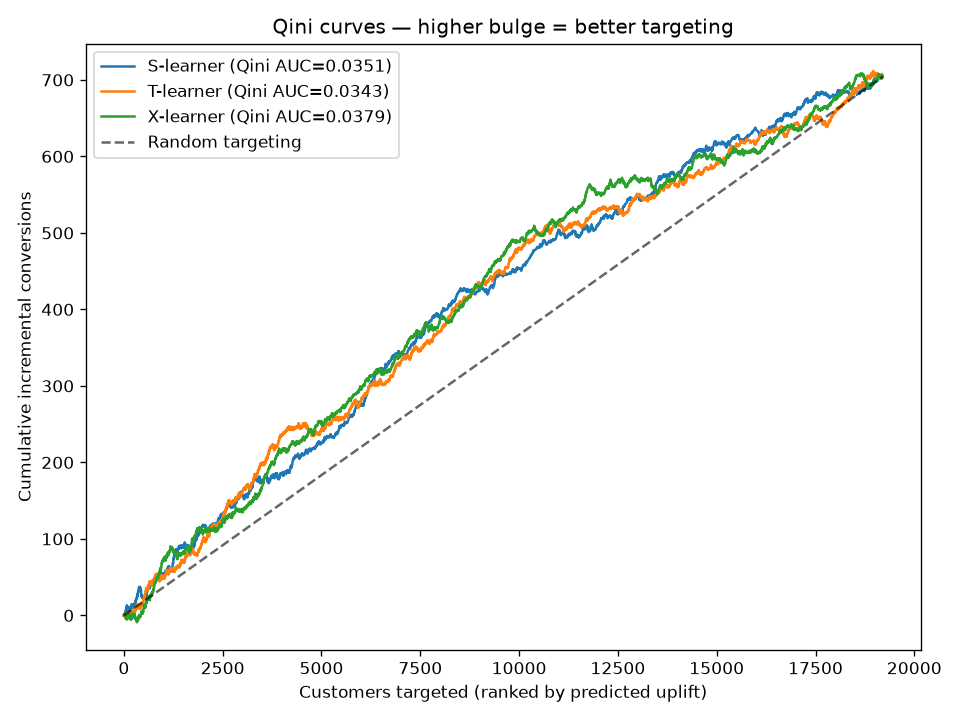
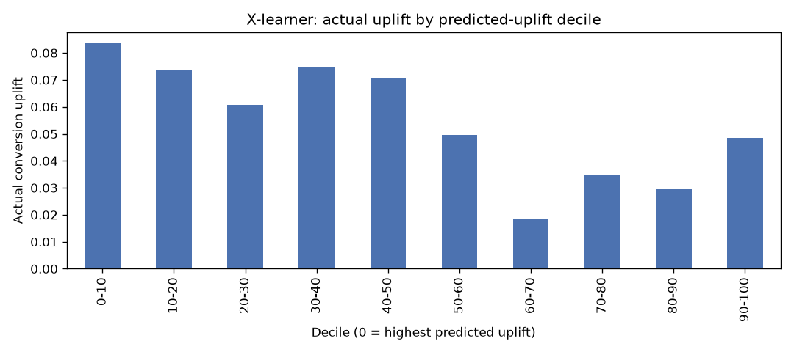
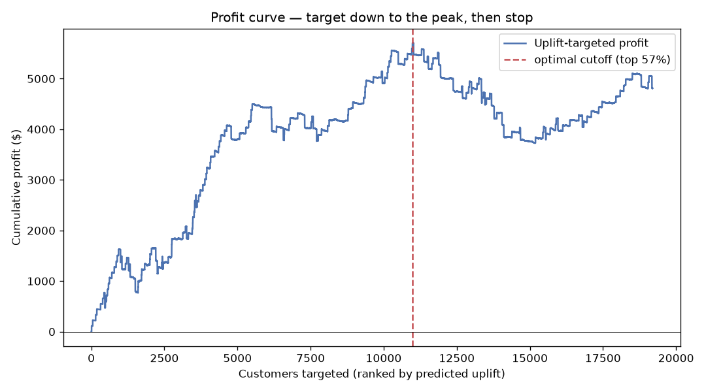
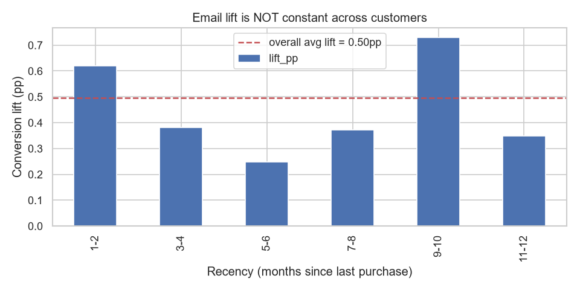
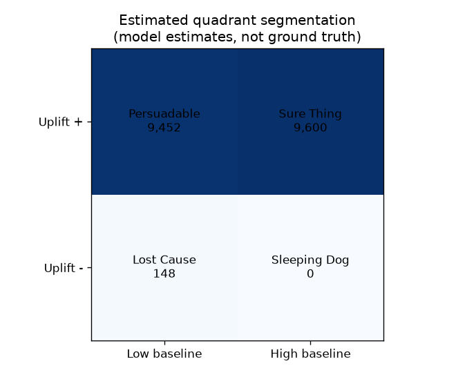
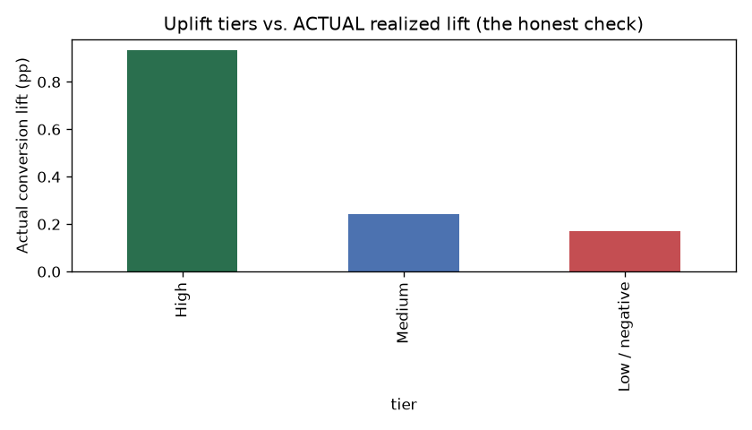

# ImpactIQ — Campaign Intelligence & Uplift Optimization Engine

<p align="center">
  <strong>From campaign prediction to causal decision-making.</strong>
</p>

<p align="center">
  An end-to-end causal machine learning system that identifies customers whose behavior is most likely to change because of a marketing intervention, evaluates uplift models, and converts treatment-effect estimates into a profit-aware targeting policy.
</p>

<p align="center">


</p>

> **Demonstration project** built on the public, randomized **Hillstrom MineThatData email dataset**. The project independently demonstrates experiment design, statistical analysis, causal inference, uplift modeling, causal-model evaluation, and campaign decision optimization.

---

## 📑 Table of Contents

- [🎯 Executive Overview](#-executive-overview)
- [💡 Why Uplift Modeling?](#-why-uplift-modeling)
- [🔍 Business Problem](#-business-problem)
- [🧠 The Core Causal Framework](#-the-core-causal-framework)
- [📊 Dataset](#-dataset)
- [🧪 Experiment Design & Statistical Validation](#-experiment-design--statistical-validation)
- [🤖 Uplift Modeling](#-uplift-modeling)
- [📏 Evaluation](#-evaluation)
- [💰 Profit-Aware Targeting](#-profit-aware-targeting)
- [📈 Key Findings](#-key-findings)
- [📊 Visual Results](#-visual-results)
- [🖥️ ImpactIQ App](#️-impactiq-app)
- [🗺️ Project Roadmap](#️-project-roadmap)
- [🏗️ Project Structure](#️-project-structure)
- [🛠️ Tech Stack](#️-tech-stack)
- [⚙️ Setup](#️-setup)
- [▶️ Run the App](#️-run-the-app)
- [📚 References & Methodology](#-references--methodology)
- [🚀 Future Improvements](#-future-improvements)
- [💼 Recruiter / IIT Placement Snapshot](#-recruiter--iit-placement-snapshot)
- [📌 Conclusion](#-conclusion)
- [👨‍💻 Connect](#-connect)
- [📄 License](#-license)

---

## 🎯 Executive Overview

**ImpactIQ** addresses a common weakness in campaign analytics:

> A customer may be likely to purchase even without receiving a campaign.

A conventional response or conversion model can identify customers who are likely to convert, but that does **not** necessarily tell a marketer whether the campaign caused the conversion.

ImpactIQ therefore estimates **incremental treatment effect / uplift**:

> **How much more likely is this customer to respond because we contacted them?**

The system then turns that causal signal into a practical campaign policy.

### End-to-end workflow

```text
Randomized Campaign Data
          ↓
Experiment Validation
          ↓
Average Treatment Effect
          ↓
Uplift / Causal Modeling
          ↓
Qini + Decile Evaluation
          ↓
Individual Treatment Effect Ranking
          ↓
Campaign Economics
          ↓
Profit-Optimized Targeting
          ↓
Interactive Streamlit Decision Tool
```

### Core capabilities

- Experiment design and power analysis
- Randomization balance checks
- Average Treatment Effect (ATE)
- Treatment-effect interpretation
- S-learner
- T-learner
- Hand-rolled X-learner
- Qini curve / Qini AUC evaluation
- Uplift-by-decile analysis
- Profit-aware campaign optimization
- Cost sensitivity analysis
- Customer-level uplift scoring
- Actionable targeting tiers
- Interactive Streamlit application

---

## 💡 Why Uplift Modeling?

Consider two customers.

### Customer A

```text
No Email → Purchase
Email    → Purchase
```

This customer is a **Sure Thing**.

Sending the email may produce a purchase, but the customer would have purchased anyway. The campaign therefore creates little or no incremental value.

### Customer B

```text
No Email → No Purchase
Email    → Purchase
```

This customer is **Persuadable**.

The marketing intervention changes the customer's behavior.

That distinction is the foundation of uplift modeling.

### Prediction vs. Causal Decision

| Conventional ML | Uplift Modeling |
|---|---|
| Predicts outcome | Estimates treatment effect |
| Who will convert? | Who will convert **because of treatment**? |
| Can favor existing high-intent customers | Can identify persuadable customers |
| Optimizes response prediction | Optimizes incremental response |
| Often ignores control response | Explicitly uses treatment/control outcomes |

---

## 🔍 Business Problem

Marketing teams face a constrained decision:

> **Who should receive the campaign?**

A naive strategy sends the campaign to everyone.

A response model may target customers with the highest predicted conversion probability.

But both approaches can waste budget on customers who would have responded without intervention.

ImpactIQ instead asks:

> **Which customers have the highest expected incremental response, and is contacting them economically worthwhile?**

This enables marketing teams to:

- prioritize persuadable customers,
- avoid unnecessary treatment of sure things,
- identify potentially harmful treatment effects,
- reduce wasted campaign spend,
- incorporate contact cost,
- optimize the campaign cutoff,
- and maximize incremental profit.

---

## 🧠 The Core Causal Framework

The project uses the four standard treatment-response segments:

| | **Buys if treated** | **Doesn't buy if treated** |
|---|---|---|
| **Buys if not treated** | 🟢 **Sure Thing** — campaign adds little incremental value | 🔴 **Sleeping Dog** — treatment may hurt |
| **Doesn't buy if not treated** | ⭐ **Persuadable** — ideal targeting group | ⚪ **Lost Cause** — unlikely to respond |

### Targeting objective

The campaign should primarily prioritize:

> **Persuadables — customers whose behavior is expected to change positively because of treatment.**

And, where model evidence supports it, avoid:

> **Sleeping Dogs — customers for whom treatment may have a negative effect.**

This is fundamentally different from simply targeting customers with the highest probability of purchase.

---

## 📊 Dataset

ImpactIQ uses the public **Hillstrom MineThatData E-Mail Analytics And Data Mining Challenge** dataset.

### Dataset characteristics

- **64,000 customers**
- Random assignment to:
  - men's-merchandise email
  - women's-merchandise email
  - no email control
- Outcomes observed for approximately two weeks
- Key outcomes:
  - visit
  - conversion
  - spend

For the main uplift analysis, the two email treatment arms are combined into a single **treated** group and compared with the **no-email control** group.

### Why this dataset?

The randomized design makes it particularly useful for demonstrating:

- treatment/control analysis,
- average treatment effects,
- heterogeneous treatment effects,
- uplift modeling,
- causal evaluation,
- and campaign optimization.

---

## 🧪 Experiment Design & Statistical Validation

The project does not treat the dataset as a black box.

It explicitly considers the experiment-design layer.

### Experiment design responsibilities

A production data scientist should consider:

- eligible population
- treatment/control assignment
- stable-hash randomization
- sample-size requirements
- statistical power
- guardrails
- balance checks
- outcome definitions

The Hillstrom dataset is already randomized, so this repository analyzes an existing experiment. However, **Sprint 1 documents a from-scratch experiment-design approach**, including power analysis.

### Analytical sequence

```text
Experiment Design
       ↓
Power Analysis
       ↓
Randomization Balance
       ↓
Treatment vs Control
       ↓
Average Treatment Effect
       ↓
Heterogeneous Treatment Effects
```

This gives the project both an **experimental-design perspective** and a **causal-analysis perspective**.

---

## 🤖 Uplift Modeling

Three uplift approaches are evaluated.

### 1. S-Learner

A single model receives treatment assignment as a feature.

Conceptually:

```text
Features + Treatment
        ↓
   Outcome Model
        ↓
Potential Outcomes
        ↓
Estimated Uplift
```

### 2. T-Learner

Separate models are trained for treatment and control groups.

```text
              ┌──→ Treatment Model ──→ Ŷ(1)
Features ─────┤
              └──→ Control Model ────→ Ŷ(0)

Uplift = Ŷ(1) − Ŷ(0)
```

### 3. X-Learner

The X-learner is implemented from scratch in:

```text
src/uplift_models.py
```

The implementation uses propensity-weighted treatment-effect modeling and is designed to handle the treatment/control imbalance in the dataset.

### Why implement the X-learner manually?

This demonstrates understanding of the underlying causal-learning workflow rather than relying entirely on a high-level causal ML package.

The project uses **pure scikit-learn components**, avoiding a compiler/causalml dependency for the core X-learner implementation.

---

## 📏 Evaluation

Traditional classification metrics alone are insufficient for evaluating uplift models.

The project therefore uses causal/uplift-specific evaluation.

### Qini Curve

The Qini curve measures whether the model can rank customers by expected **incremental treatment response** better than random targeting.

### Qini AUC

Higher Qini AUC indicates stronger ranking of customers by incremental response.

### Uplift by Decile

Customers are:

1. ranked by predicted uplift,
2. divided into deciles,
3. evaluated for incremental response.

This shows whether the model concentrates treatment effect among the highest-ranked customers.

### Evaluation framework

```text
Predicted Uplift
      ↓
Customer Ranking
      ↓
Decile Assignment
      ↓
Incremental Response
      ↓
Qini Curve
      ↓
Qini AUC
```

---

## 💰 Profit-Aware Targeting

Prediction alone is not the final objective.

ImpactIQ converts uplift into an economic decision.

### Campaign economics

The targeting policy considers:

- predicted incremental response,
- campaign contact cost,
- value per conversion,
- cumulative campaign profit.

For the demonstrated scenario:

- average conversion value ≈ **$116**
- email cost = **$0.10 per contact**

The profit-maximizing policy targets approximately the **top 57%** of customers ranked by predicted uplift.

### Decision logic

```text
Predicted Uplift
      +
Conversion Value
      -
Contact Cost
      ↓
Expected Incremental Profit
      ↓
Optimal Targeting Cutoff
```

### Why this matters

A lower campaign cost can justify a broader audience.

A higher contact cost makes unnecessary outreach more expensive and therefore tightens the optimal targeting cutoff.

This makes uplift modeling especially valuable for expensive channels such as:

- direct mail,
- outbound calls,
- high-cost personalized outreach.

---

## 📈 Key Findings

### 1. The campaign works on average

Conversion increases from:

**0.57% → 1.07%**

That corresponds to:

- **0.50 percentage-point absolute lift**
- approximately **87% relative lift**
- 95% CI: **[0.355, 0.636] percentage points**
- **p ≈ 4 × 10⁻¹⁰**

The average campaign effect is statistically strong.

### 2. Average lift hides meaningful customer heterogeneity

By customer recency, observed lift ranges approximately:

**0.25–0.73 percentage points**

That is roughly a **3× spread**.

Therefore:

> An average treatment effect can tell us whether a campaign works overall, but not necessarily whom to target.

### 3. Conversion is too rare for reliable uplift modeling here

Conversion occurs at approximately **1%**.

On this rare outcome, the uplift models do **not reliably outperform random targeting**, with Qini AUC approximately **0**.

This is an important modeling diagnosis:

> The bottleneck is outcome density, not simply algorithm complexity.

Trying a stronger learner on an extremely sparse outcome can amplify noise rather than reveal useful individual treatment effects.

### 4. The modeling target was therefore changed to visit

The denser **visit** outcome provides enough signal for uplift modeling.

The project deliberately keeps:

- **conversion = business objective**
- **visit = modeling proxy supported by the data**

This is an explicit and documented modeling trade-off.

### 5. X-learner performs best on visit

| Model | Qini AUC |
|---|---:|
| **X-learner** | **0.038** |
| S-learner | 0.035 |
| T-learner | 0.034 |

The X-learner has the strongest ranking performance among the evaluated approaches.

### 6. Targeting the right customers improves economics

Under the demonstrated campaign assumptions, the optimal policy targets approximately the **top 57%** of customers.

This outperforms:

- blanket sending,
- and random targeting of the same audience size.

The analysis therefore reinforces the core principle:

> **The value comes from contacting the right customers, not simply from contacting fewer customers.**

---

## 📊 Visual Results

The repository already contains a visual-results section and the corresponding figures.

### 1. Model Comparison — Qini Curves



The Qini curves compare the uplift learners against random targeting. On the denser visit outcome, all three models outperform the random baseline, with the X-learner achieving the highest Qini AUC.

---

### 2. Incremental Lift by Customer Decile



Customers are ranked from highest to lowest predicted uplift and grouped into deciles.

The highest-ranked groups show stronger incremental response, supporting targeted rather than uniform campaign allocation.

---

### 3. Profit-Optimized Targeting Policy



The cumulative profit curve identifies the targeting cutoff that maximizes expected campaign value under the assumed economics.

The current scenario peaks at approximately **57% targeted**.

---

### 4. Campaign Lift by Customer Recency



Treatment impact varies across customer recency groups, demonstrating why a single campaign-wide average is insufficient for customer-level targeting.

---

### 5. Estimated Uplift Segmentation



The estimated treatment-response framework separates customers into:

- Persuadables
- Sure Things
- Lost Causes
- Sleeping Dogs

The targeting policy emphasizes customers estimated to be persuadable.

---

### 6. Actionable Targeting Tiers



Predicted uplift is translated into practical targeting tiers so that marketing teams can prioritize high-impact customers and avoid low- or negative-uplift segments.

---

## 🖥️ ImpactIQ App

The repository includes a **Streamlit decision application** that turns the causal analysis into an interactive campaign optimization tool.

Run:

```bash
streamlit run app/streamlit_app.py
```

after training the model.

### Core app experiences

#### 1. Campaign Optimizer

The app provides a cost-per-email slider and dynamically shows:

- optimal targeting cutoff,
- expected profit,
- profit curve,
- campaign economics.


#### 2. Cost Sensitivity

The app demonstrates how increasing contact cost changes the economically optimal targeting policy.


#### 3. Customer-Level Uplift Scoring

Users can enter customer features and receive:

- predicted uplift,
- targeting recommendation,
- target / target-if-cheap / skip decision.


#### 4. Method Story

The Story tab explains the methodology in plain language:

- experiment validation,
- average treatment effect,
- uplift models,
- conversion → visit modeling decision,
- targeting policy.


---

## 🗺️ Project Roadmap

All planned project sprints are documented as completed:

| Sprint | Scope | Status |
|---|---|---|
| 1 | Experiment design & power analysis | ✅ |
| 2 | Load, EDA & randomization balance checks | ✅ |
| 3 | Average treatment effect | ✅ |
| 4 | S-, T-, and X-learner uplift models | ✅ |
| 5 | Uplift evaluation | ✅ |
| 6 | Campaign optimizer, cost sensitivity & incremental revenue | ✅ |
| 7 | Streamlit app & polish | ✅ |

---

## 🏗️ Project Structure

```text
impactiq-campaign-uplift-optimization/
│
├── data/
│   ├── raw/                         # Downloaded data (gitignored)
│   └── processed/                   # Processed data (gitignored)
│
├── notebooks/
│   ├── 02_eda_balance_checks.ipynb
│   ├── 03_average_treatment_effect.ipynb
│   ├── 04_uplift_models.ipynb
│   ├── 05_uplift_evaluation.ipynb
│   └── 06_targeting_policy.ipynb
│
├── src/
│   ├── download_data.py
│   ├── power_analysis.py
│   └── uplift_models.py
│
├── reports/
│   ├── sprint1_experiment_design.md
│   └── figures/
│       ├── qini_curves.png
│       ├── uplift_by_decile.png
│       ├── profit_curve.png
│       ├── lift_by_recency.png
│       ├── quadrant_segmentation.png
│       └── uplift_tiers.png
│
├── app/
│   └── streamlit_app.py
│
├── assets/
│   ├── app_targeting_policy.pdf
│   ├── app_cost_sensitivity.pdf
│   ├── app_customer_scoring.pdf
│   └── app_story.pdf
│
├── requirements.txt
└── README.md
```

---

## 🛠️ Tech Stack

### Programming & Data

- Python
- pandas
- NumPy
- scikit-learn

### Statistics & Experimentation

- statsmodels
- Power analysis
- Proportion tests
- Treatment/control analysis

### Causal Machine Learning

- Uplift modeling
- S-learner
- T-learner
- X-learner
- Individual treatment-effect estimation
- Qini evaluation

### Visualization

- Matplotlib
- Uplift/Qini visualizations

### Application

- Streamlit

### Engineering

- Modular Python source code
- Jupyter notebooks
- Git & GitHub

> The X-learner is implemented from scratch in `src/uplift_models.py`, using scikit-learn components rather than a dedicated causal ML dependency.

---

## ⚙️ Setup

### 1. Clone the repository

```bash
git clone https://github.com/abhi-iitg/impactiq-campaign-uplift-optimization.git
cd impactiq-campaign-uplift-optimization
```

### 2. Create a virtual environment

#### Windows

```bash
python -m venv venv
venv\Scripts\activate
```

#### macOS / Linux

```bash
python -m venv venv
source venv/bin/activate
```

### 3. Install dependencies

```bash
pip install -r requirements.txt
```

### 4. Download the dataset

```bash
python src/download_data.py
```

The project can alternatively use the Hillstrom dataset downloaded into:

```text
data/raw/
```

---

## ▶️ Run the Analysis

Run the notebooks in sequence:

```text
02 → 03 → 04 → 05 → 06
```

### Notebook workflow

| Notebook | Purpose |
|---|---|
| `02_eda_balance_checks.ipynb` | EDA and randomization checks |
| `03_average_treatment_effect.ipynb` | Average treatment effect |
| `04_uplift_models.ipynb` | S-, T-, and X-learners |
| `05_uplift_evaluation.ipynb` | Qini and uplift evaluation |
| `06_targeting_policy.ipynb` | Profit-aware targeting |

Sprint 1 is documented separately in:

```text
reports/sprint1_experiment_design.md
```

---

## ▶️ Run the App

After the analysis notebooks have generated the processed datasets:

```bash
python src/train_model.py
```

Then:

```bash
streamlit run app/streamlit_app.py
```

The app provides:

1. **Campaign Optimizer**
2. **Cost Sensitivity**
3. **Per-Customer Uplift Scoring**
4. **Method Story**

---

## 📚 References & Methodology

### Dataset

**Kevin Hillstrom — MineThatData E-Mail Analytics And Data Mining Challenge (2008)**

The public randomized email dataset is the foundation for the demonstration.

The repository also supports loading the dataset through `scikit-uplift`.

### Causal Meta-Learners

Künzel, Sekhon, Bickel & Yu (2019):

> *Metalearners for estimating heterogeneous treatment effects using machine learning.*

PNAS, 116(10), 4156–4165.

The work provides the framework underlying S-, T-, and X-learners.

### Uplift Modeling

Gutierrez & Gérardy (2017):

> *Causal Inference and Uplift Modelling: A Review of the Literature.*

PMLR 67:1–13.

The reference informs uplift evaluation and the use of Qini/uplift curves.

### Additional Learning Resource

Juan Camilo Orduz:

> *Introduction to Uplift Modeling*

The hands-on tutorial informed the meta-learner and evaluation approach.

---

## 🚀 Future Improvements

The current project can be extended toward a production-grade causal decision platform.

### Causal inference

- Doubly robust estimators
- Causal forests
- Bayesian treatment-effect models
- Sensitivity analysis for unobserved confounding
- Treatment-effect calibration

### Modeling

- Gradient boosting base learners
- Cross-fitting
- Hyperparameter optimization
- Probability calibration
- Representation learning for heterogeneous treatment effects

### Business optimization

- Multi-channel campaign optimization
- Integer programming
- Customer-level contact-frequency constraints
- Channel-specific costs
- Customer Lifetime Value integration
- Incremental revenue rather than predicted revenue
- Multi-campaign budget allocation

### Experimentation

- Automated experiment design
- Sequential testing
- Holdout/control monitoring
- A/B test result pipelines
- Incrementality measurement

### Product / Engineering

- Production API
- Batch scoring
- Model monitoring
- Data-quality checks
- Experiment monitoring dashboard
- Role-based campaign management
- What-if campaign simulation

---

## 💼 Recruiter / IIT Placement Snapshot

### What this project demonstrates

| Skill Area | Demonstrated Capability |
|---|---|
| **Causal Inference** | Treatment effects and heterogeneous response |
| **Uplift Modeling** | S-, T-, and X-learners |
| **Experimentation** | Power analysis and randomized treatment/control validation |
| **Statistics** | ATE, confidence intervals, significance testing |
| **Machine Learning** | Scikit-learn based meta-learners |
| **Model Evaluation** | Qini curves, Qini AUC, uplift-by-decile |
| **Optimization** | Profit-aware campaign cutoff |
| **Business Analytics** | Incremental revenue and campaign economics |
| **Product Thinking** | Prediction → decision → action workflow |
| **Application Engineering** | Interactive Streamlit decision tool |

### Strong interview talking points

**Q1. Why isn't a conversion model enough?**

Because a customer can be highly likely to convert even without treatment. Uplift modeling focuses on the **incremental effect of treatment**.

**Q2. What is the most important customer segment?**

The **Persuadable** segment—customers whose behavior is expected to change positively because of treatment.

**Q3. Why did the project model visit instead of conversion?**

Conversion was too rare to produce reliable individual-level uplift estimates. The conversion uplift models were approximately random, so the denser visit outcome was used as the modeling proxy while conversion remained the business objective.

**Q4. Why is the X-learner important?**

It provided the strongest Qini AUC on the visit outcome among the evaluated approaches and explicitly handles treatment/control response modeling.

**Q5. Why use Qini AUC instead of accuracy?**

Because uplift modeling evaluates **incremental treatment effect**, not ordinary outcome classification. Accuracy can reward predictions of customers who would respond regardless of treatment.

**Q6. What is the business decision produced by the model?**

A ranked targeting policy that determines **who should receive the campaign under specific campaign economics**.

**Q7. What is the most important modeling lesson?**

A more complex model does not automatically solve a weak-signal problem. When the outcome is extremely rare, model complexity can increase overfitting rather than uncovering reliable individual treatment effects.

---

## 📌 Conclusion

### Beyond Prediction: Causal Intelligence for Campaign Decisions

ImpactIQ demonstrates a progression from:

```text
Campaign Data
      ↓
Experimentation
      ↓
Causal Analysis
      ↓
Treatment-Effect Modeling
      ↓
Uplift Evaluation
      ↓
Economic Optimization
      ↓
Business Action
```

The key principle is:

> **Do not ask only who is likely to buy. Ask who is likely to buy because we intervene—and whether that intervention is worth paying for.**

That distinction turns campaign analytics from **response prediction** into **incrementality-driven decision intelligence**.

---

## 👨‍💻 Connect

**Abhishek Kumar Gond**  
B.Tech — Chemical Engineering, IIT Guwahati

- **GitHub:** [abhi-iitg](https://github.com/abhi-iitg)
- **LinkedIn:** [Abhishek Kumar Gond](https://www.linkedin.com/in/abhishekkumargond/)
- **Portfolio:** [Abhishek's Portfolio](https://abhishek-kg-portfolio-pied.vercel.app/)
- **Email:** mr.abhishekaaa@gmail.com

If you find the project useful, consider giving the repository a ⭐.

---

## 📄 License

This project is licensed under the **MIT License**.

See the [`LICENSE`](LICENSE) file for details.

---

<p align="center">
  <strong>ImpactIQ — From Campaign Prediction to Causal Decision Intelligence.</strong>
</p>
